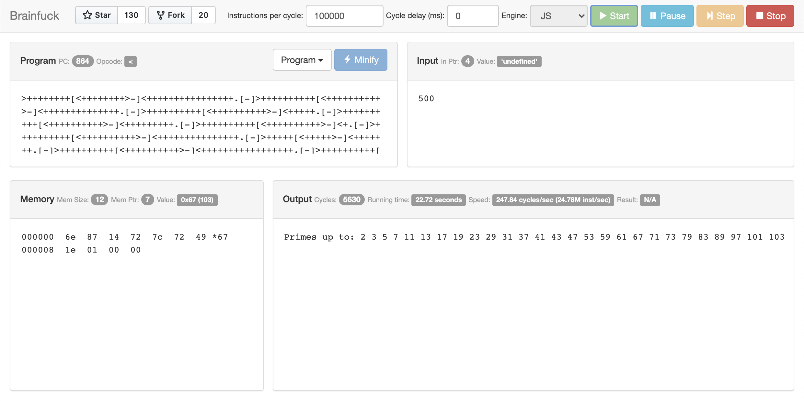

# Brainf\*ck

A collection of [brainfuck](http://www.muppetlabs.com/~breadbox/bf/) interpreters/translators. 

## Contents

- [Intro](#intro)
- [Programs](#programs)
- [Languages](#languages)
    - [asm](#asm)
    - [C](#c)
    - [C++](#c-1)
    - [Golang](#go) (contributed by [Philip K.](https://github.com/phikal))
    - [Haskell](#haskell)
    - [Javascript](#javascript)
    - [Lua](#lua) (contributed by [François Perrad](https://github.com/fperrad))
    - [Python](#python)
    - [Rust](#rust)
    - [WASM](#wasm)
- [Benchmark](#benchmark)
- [See also](#see-also)

## Intro

This project is just really a playground to try different languages. A nice excuse to do something a bit more complex than a "hello world". New BF programs or interpreters in other languages are absolutely welcome!

## Programs

The `programs` directory contains a gallery of BF programs, most of them taken from other sites dedicated to BF (check [See Also](#See_Also)). Notable mentions:

 * [dbf2c.bf](programs/dbf2c.bf): A Brainfuck to C translator.
 * [dbfi.bf](programs/dbfi.bf): A Brainfuck interpreter in Brainfuck.
 * [fibonacci.bf](programs/fibonacci.bf): Fibonacci number generator.
 * [mandelbrot.bf](programs/mandelbrot.bf): Mandelbrot set generator.
 * [numwarp.bf](programs/numwarp.bf): Displays numbers from stdin vertically.
 * [primes.bf](programs/primes.bf): Prime numbers generator.
 * [sierpinski.bf](programs/sierpinski.bf): "Sierpinsky Triangle" generator.

## Languages

### asm

Simple interpreter written in x86_64 asm, using Mac OS syscall conventions.

Source: [asm/brainfuck.s](asm/brainfuck.s)

    $ cd asm
    $ make
    as -arch x86_64 brainfuck.s -o brainfuck.o
    ld -e _main -arch x86_64 -lc brainfuck.o -o brainfuck 
    ld: warning: -macosx_version_min not specified, assuming 10.6
    rm brainfuck.o
    $ ./brainfuck ../programs/primes.bf
    Primes up to: 50
    2 3 5 7 11 13 17 19 23 29 31 37 41 43 47  

### C

Simple implementation, with precalculated jumps.

Source: [c/brainfuck.c](c/brainfuck.c)

    $ cd c
    $ make brainfuck
    cc brainfuck.c -o brainfuck
    $ ./brainfuck ../programs/hello.bf
    Hello World!


### C++

C++ version, with improved optimizations (expression tree with compressed contiguous identical operations).

Tested with Clang 11.0.3 and GCC 10.1.0.

Source: [cpp/brainfuck.cpp](cpp/brainfuck.cpp)

    $ cd cpp
    $ make brainfuck
    c++ -std=c++14 -g -O3 brainfuck.cpp -o brainfuck
    $ ./brainfuck ../programs/hello.bf
    Hello World!


### Golang

Source: [go/brainfuck.go](go/brainfuck.go)

Running the number warper with the go interpreter:

    $ cd go
    $ GOPATH=$PWD go run brainfuck.go ../programs/numwarp.bf
    32
      /\
       / 
    /\ \/
     /\
      /

Thanks [Philip K.](https://github.com/phikal) for the contribution!

### Haskell

Interpreter source: [haskell/brainfuck.hs](haskell/brainfuck.hs)

Translator to C: [haskell/bf2c.hs](haskell/bf2c.hs)

To run the interpreter:

    $ cd haskell
    $ runhaskell brainfuck.hs ../programs/hello.bf
    Hello World!

To translate any BF program to C:

    $ cd haskell
    $ make ../programs/sierpinski.c
    runhaskell bf2c.hs < ../programs/sierpinski.bf | indent > sierpinski.c
    $ make sierpinski
    cc sierpinski.c -o sierpinski
    $ ./sierpinski
    [...]

### Javascript

Source: [javascript/brainfuck.js](javascript/brainfuck.js)

Simple debugger-like UI, using Bootstrap and jQuery (yes, I'm old school) with support for:

  * Memory inspection
  * Step-by-step execution
  * Configurable speed (instructions per cycle/delay between cycles)
  * Gallery of sample programs, loaded on the fly
  * Choice of pure JS or [WASM](#WASM) engine



The JS version can run in stand-alone mode, but to enable the WASM engine a minimal HTTP server is needed. In the `./javascript` directory, run:

```
$ cd javascript
$ python -m SimpleHTTPServer
Serving HTTP on 0.0.0.0 port 8000 ...
```

Then connect to <http://localhost:8000>

Alternatively, use the online version available at <http://pablojorge.github.io/brainfuck>.

### Lua

Interpreter source: [lua/brainfuck.lua](lua/brainfuck.lua)

Translator source: [lua/bf2lua.lua](lua/bf2lua.lua)

The interpreter is compatible with Lua 5.1, 5.2 and 5.3, and runs with [LuaJIT](http://luajit.org/). To run it:

    $ cd lua
    $ lua brainfuck.lua ../programs/hello.bf
    Hello World!

Running the same program, but the version translated to Lua:

    $ cd lua
    $ lua bf2lua.lua ../programs/hello.bf | lua -
    Hello World!

Thanks [François Perrad](https://github.com/fperrad) for the contribution!

### Python

Original, unoptimized, verbose interpreter: [python/brainfuck.py](python/brainfuck.py).

Optimized (no method lookups, pre-computed jumps over minified source): [python/brainfuck-simple.py](python/brainfuck-simple.py).

Slightly modified version of the optimized interpreter so it can be translated to C, using RPython: [python/brainfuck-rpython.py](python/brainfuck-rpython.py)

JIT-enabled version: [python/brainfuck-rpython-jit.py](python/brainfuck-rpython-jit.py)

Using the plain python interpreter to run a "helloworld" program:

    $ cd python
    $ cat << EOF | python brainfuck.py 
    > ++++++++++[>+++++++>++++++++++>+++>+<<<<-]>++.>+.+++++++..+++.>++.<<+++++++++++++++.>.+++.------.--------.>+.>.
    > EOF
    Hello World!

To use the RPython version: 

    $ cd <pypy-source>
    $ python rpython/translator/goal/translate.py ~/Projects/github/brainfuck/python/brainfuck-rpython.py
    $ time ./brainfuck-rpython-c ~/Projects/github/brainfuck/programs/mandelbrot.bf
    [...]
    real  0m29.978s
    user  0m29.796s
    sys  0m0.110s

To use the JIT-enabled version: (thanks [Gsam](https://github.com/GSam) for the suggestion)

    $ python rpython/translator/goal/translate.py --opt=jit ~/Projects/github/brainfuck/python/brainfuck-rpython-jit.py
    $ time ./brainfuck-rpython-jit-c ~/Projects/github/brainfuck/programs/mandelbrot.bf
    [...]
    real  0m4.943s
    user  0m4.867s
    sys  0m0.043s

### Rust

Interpreter source: [rust/src/lib.rs](rust/src/lib.rs). Includes improved optimizations (compressing identical contiguous operations)

Translator source: [rust/src/bin/translate.rs](rust/src/bin/translate.rs). Supports translating to Rust and C.

To run the interpreter:

```
$ cd rust
$ cargo run ../programs/primes.bf
    Finished dev [optimized + debuginfo] target(s) in 0.01s
     Running `target/debug/main ../programs/primes.bf`
Primes up to: 50
2 3 5 7 11 13 17 19 23 29 31 37 41 43 47
```

To translate to Rust:

```
$ ./translate.sh ../programs/mandelbrot.bf rs
    Finished dev [optimized + debuginfo] target(s) in 0.02s
     Running `target/debug/translate rs`
   Compiling brainfuck v0.1.0 (/Users/pablo/Projects/github/pablojorge/brainfuck/rust)
    Finished dev [optimized + debuginfo] target(s) in 0.38s

real	0m0.419s
user	0m0.299s
sys	0m0.134s
    Finished dev [optimized + debuginfo] target(s) in 0.01s
     Running `target/debug/mandelbrot`
[...]

real	0m2.049s
user	0m1.976s
sys	0m0.047s
```

And to C:

```
$ ./translate.sh ../programs/mandelbrot.bf c
    Finished dev [optimized + debuginfo] target(s) in 0.02s
     Running `target/debug/translate c`
cc -O1 mandelbrot.c -o mandelbrot

real	0m1.603s
user	0m1.448s
sys	0m0.114s
[...]

real	0m1.006s
user	0m0.985s
sys	0m0.009s
```

### WASM

Rust interpreter, prepared to be compiled to WASM: [wasm/src/lib.rs](wasm/src/lib.rs)

To generate the WASM binary and JS glue:

    $ cd rust
    $ wasm-pack build --target web

That will generate the target libs in `./pkg`. To try in the browser:

    $ python -m SimpleHTTPServer

And then connect to <http://localhost:8000>. Modify the `program` and `input` vars in `index.html` to try other programs.

## Benchmark

|                                        | Mandelbrot  | Primes up to 100 |
|                                   ---: | :---:       | :---:            |
| Non-optimized python version (CPython) | 991m45.631s | 19m34.163s       |
|    Non-optimized python version (PyPy) | 24m59.928s  | 0m28.210s        |
|    Simplified python version (CPython) | 67m39.287s  | 1m16.431s        |
|       Simplified python version (PyPy) | 1m35.345s   | 0m2.144s         |
|      Improved python version (RPython) | 0m29.796s   | 0m0.486s         |
|      JIT-enabled version (RPython-JIT) | 0m4.867s    | 0m0.107s         |
|                              Assembler | 1m7.288s    | 0m1.501s         |
|                    C Interpreter (-O0) | 2m7.036s    | 0m2.012s         |
|                    C Interpreter (-O1) | 1m7.504s    | 0m1.005s         |
|                  Translated to C (-O0) | 0m19.674s   | 0m0.243s         |
|                  Translated to C (-O1) | 0m1.360s    | 0m0.012s         |

Notes:

  * The _same_ code is 40 times slower in CPython vs PyPy. You can have a really big gain for "free" (almost), by just using the PyPy interpreter.
  * Adapting the source to RPython is not free of course, and the gain is not as big, BUT if we explictly add support for the JIT, the gain makes it totally worthy. In fact the gain of this version compared with running the simplified version (unmodified) with PyPy, is comparable to the gain obtained by running the unmodified version with PyPy vs running it with CPython.
  * The other performance differences are totally expected (C interpreter compiled with optimisations has an equivalent performance to the assembler interpreter, the translated to C version is almost two orders of magnitude faster than the interpreted version, etc.).
  * The JIT-enabled Python version runs _faster_ than the translated-to-C version (compiled without optimizations).

## See Also

  * <http://en.wikipedia.org/wiki/Brainfuck>
  * <http://esoteric.sange.fi/brainfuck/bf-source/prog/>
  * [El Brainfuck](http://copy.sh/brainfuck/) by Fabian Hemmer (<http://copy.sh/>)